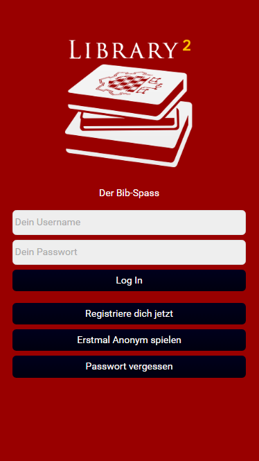
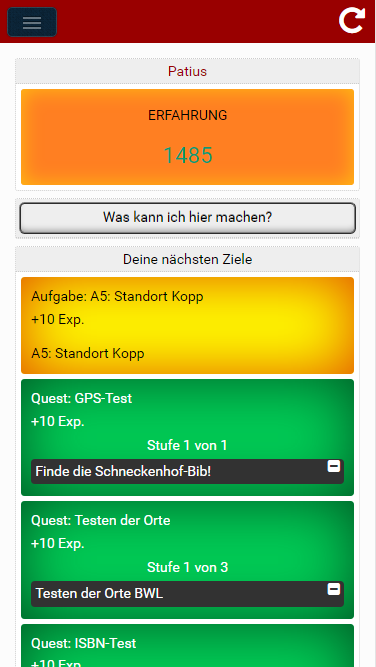
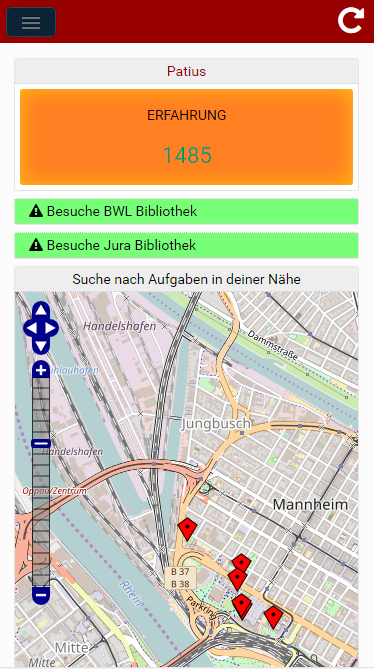
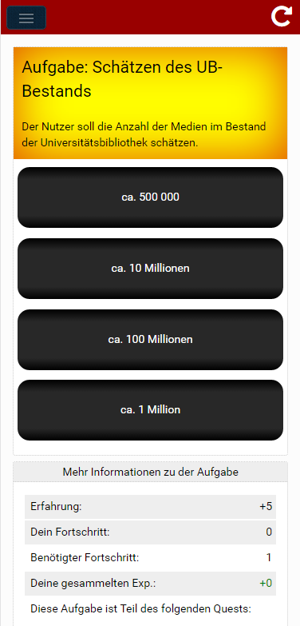
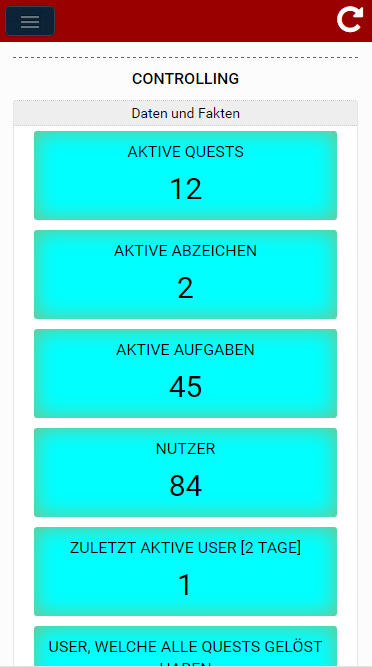

The Library Game
==============

The Library Game is a configurable Gaming-WebApp. The user can solve tasks/quests and collect badges. There are several task types available/implemented like location search, ISBN search or simple questions. It is also possible to connect a task with a location so that the user can find the task there. Everything (Locations, Task, Quests, Badges, etc.) is fully configurable by the admin users. A good application area for the Library Game is a location-based scavenger hunt.







At the moment the language of the Library Game is German.

## Table of Contents

* [Installation](#installation)
 * [Install DB](#install-db)
 * [Copy the Application to your server](#copy-the-application-to-your-server)
 * [Change settings.ini](#change-settings.ini)
 * [Change path in .htaccess and index.html](#change-path-in-.htaccess-and-index.html)
* [Usage](#usage)
* [Contributing](#contributing)
* [Licencing](#licencing)

## Installation

### 1.) Install DB

The folder Database consists of a SQL-File, which can be used to create the database and database tables, which are needed for the Library Game. The SQL-Statement does not contain the creation of a DB-User for the Library Game. So don't forget to create a DB-User by your own.

### 2.) Copy the Application to your server 

The folder Application contains the needed files for your application server. Just copy the content of this folder to your productive application server.

### 3.) Change settings.ini 

The subfolder Application/webservice builds the backend of the application. Here the file settings.ini needs to be changed. (NOTICE: You can change the name of this file to every name you want. Just check that the webservice folder contains excatly one ini-file!) Search for the DB-settings:

```ini
 DATABASE_HOST = "localhost"
 DATABASE_NAME = "Prod_LibraryGame"
 DATABASE_USER = "development_lib"
 DATABASE_PASSWORD = "123456"
```

Change them for your specific needs.

### 4.) Change path in .htaccess and index.html

The Application folder contains the two files: .htaccess and index.html.
In both there is a base path "YOURPATH", which needs to be changed. First search for the following line in the .htaccess file:

```apacheconf
 RewriteRule ^(.*) /YOURPATH/index.html [NC,L]
```

Afterwards exchange YOURPATH in the index.html file:

```html
 <!DOCTYPE html>
 <html>
  <head>
   <base href="/YOURPATH/" >
   ...
```

## Usage 

After the installation you can login to your application with the root user:

```ini
 Username: root
 Password: 123456
```

You can change the password inside the application. The root user can change things in the administration area, where tasks, quests, locations and badges can be added and edited.

## Contributing

Many thanks to all the great people for their work that helped to develop the Library Game:

* [Font Awesome by Dave Gandy](http://fontawesome.io/) (SIL OFL 1.1, MIT)
* [bootstrap](http://getbootstrap.com/) (MIT)
* [jQuery](http://jquery.com/) (MIT)
* [qrcode-generator](https://github.com/kazuhikoarase/qrcode-generator) (MIT)
* [BarcodeReader](https://github.com/EddieLa/JOB)
* [Open Street Map](https://www.openstreetmap.de/)
* [ChartNew](https://github.com/FVANCOP/ChartNew.js/) (MIT)
* [AddToHomescreen](https://github.com/cubiq/add-to-homescreen)
* [Simple Sidebar](https://github.com/BlackrockDigital/startbootstrap-simple-sidebar) (MIT)

## Licencing

This is free software. You may use it under the terms of the GNU General Public License Version 3 (GPLv3).
